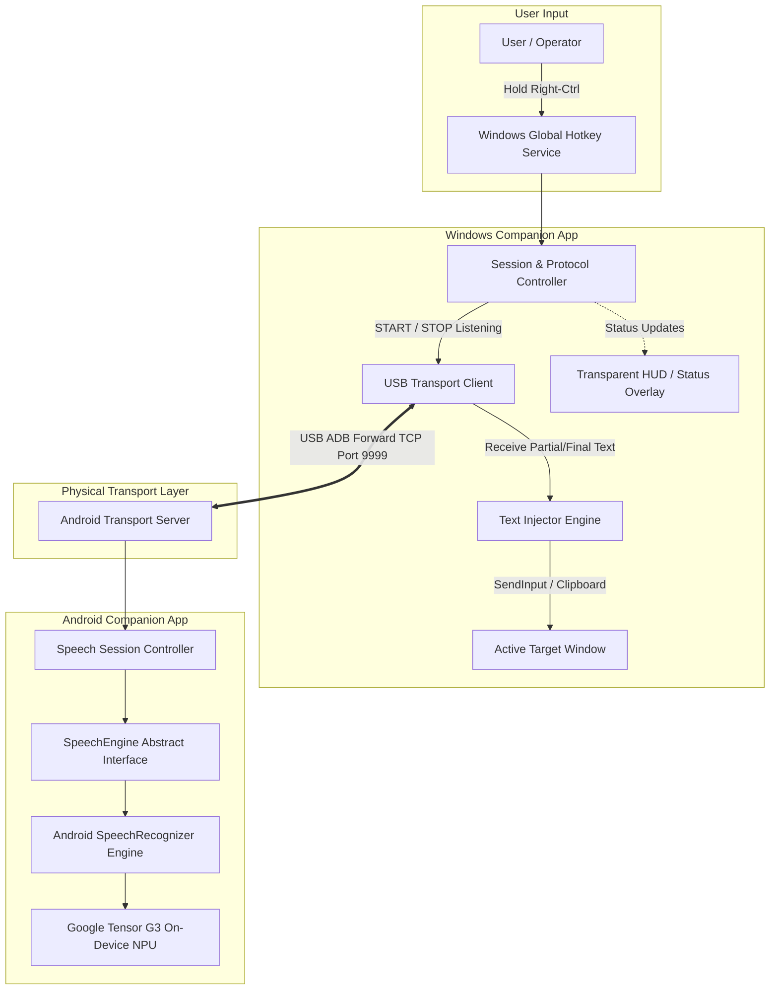
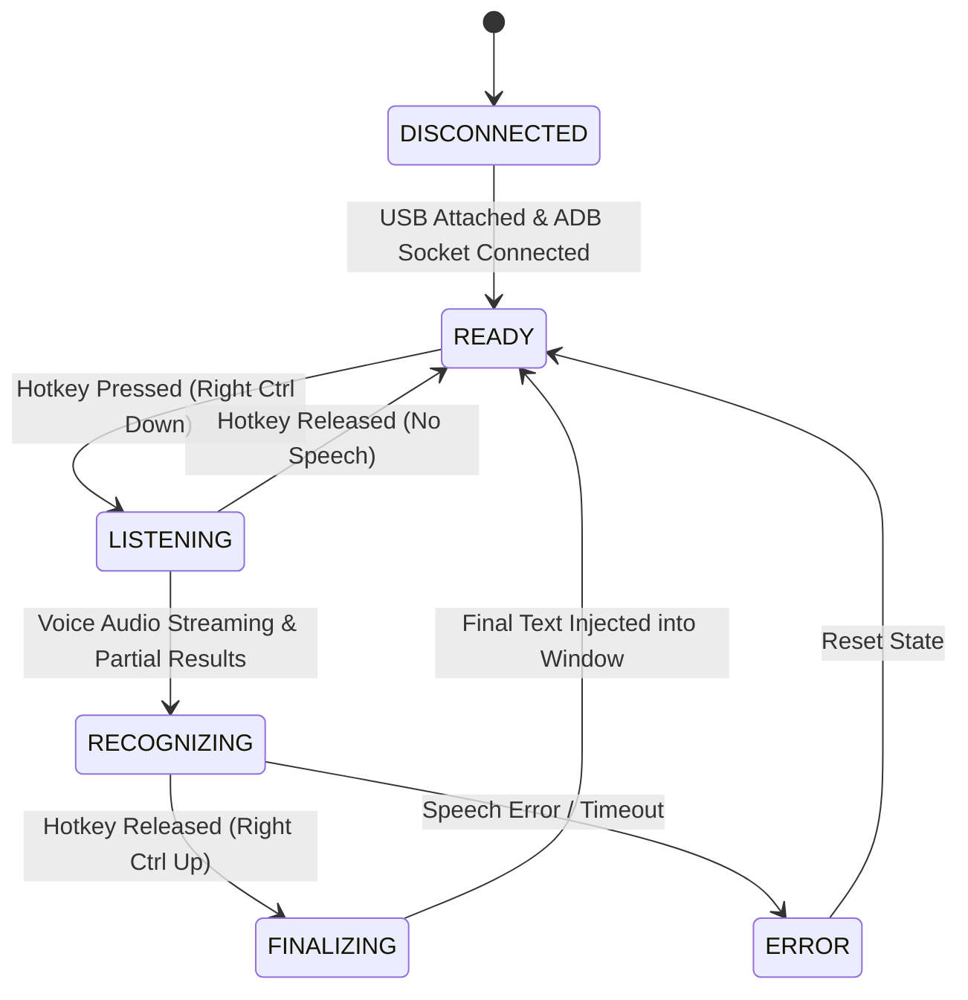
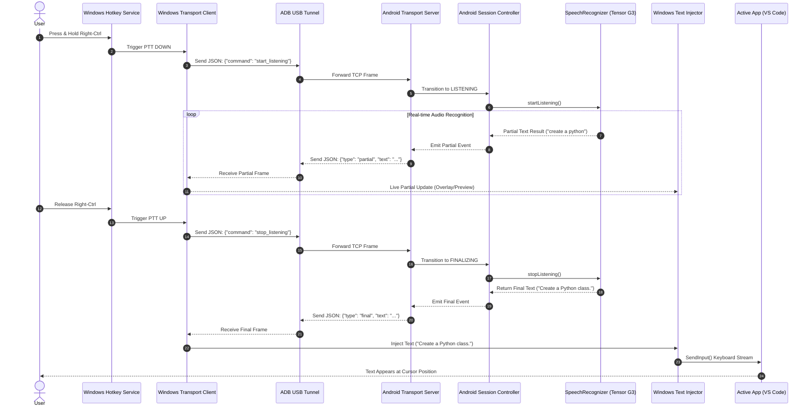

# High-Level Design (HLD): Project Hermes

> **Local-first, low-latency speech-to-text bridge between Android and Windows using on-device AI.**

---

## 1. Executive Summary & System Overview

**Project Hermes** is an open, extensible, local-first voice platform designed to bridge high-speed on-device speech recognition on Android (e.g., Pixel 8 with Google Tensor G3 NPU) to desktop applications running on Windows.

Unlike cloud-dependent dictation services or subscription-based speech tools, Hermes operates **100% offline**, routing low-latency partial and final text transcripts over a USB transport layer. Dictation is activated via a global Push-To-Talk (PTT) hotkey on Windows (e.g., holding the `Right Ctrl` key), streaming live speech recognition directly into whatever window holds system focus (VS Code, Notepad, Web Browsers, Word, Slack, etc.).

### Project Architecture & Traceability Documents
* 📐 **Editable draw.io XML Diagram**: [`docs/architecture.drawio`](file:///home/calur/github/hermes/docs/architecture.drawio)
* 📋 **Requirements Traceability Matrix (RTM)**: [`docs/RTM.md`](file:///home/calur/github/hermes/docs/RTM.md)
* 📑 **Protocol Contract Specification & JSON Schemas**: [`protocol/README.md`](file:///home/calur/github/hermes/protocol/README.md) (`protocol/schemas/v1/`)

---

## 2. Design Principles & Non-Functional Requirements

### 2.1 Core Architectural Principles
1. **Contract-First Architecture**: Inter-system protocol schemas (`protocol/`) govern communication, decoupling Android and Windows clients so both can evolve independently.
2. **Zero Cloud Dependency**: Speech processing is strictly local (Tensor G3 / Android SpeechRecognizer / Whisper.cpp), ensuring privacy and offline functionality.
3. **Pluggable Architecture**: Abstracts speech recognition engines and output processing pipelines so alternative engines (Whisper.cpp, Gemini Nano) or target actions (Voice Commands, LLM post-processing) can be added without architecture redesign.

### 2.2 Key Operational Metrics (NFRs)
| Metric | Specification Target | Rationale |
| :--- | :--- | :--- |
| **End-to-End Latency** | **< 500 ms** (speech stop to text injection) | Ensures seamless typing experience comparable to local keypresses. |
| **Windows CPU Usage** | **< 2%** idle and active | Prevents interference with heavyweight desktop workloads (IDE, games, compile jobs). |
| **Android Battery Drain** | **< 2% / hour** idle | Foreground service must be energy-efficient. |
| **Network Dependency** | **None (Air-Gapped)** | Relies on USB ADB socket communication. |

---

## 3. High-Level System Architecture

### 3.1 Architectural Block Diagram



---

## 4. Draw.io Architectural Diagram Format

The architectural topology is captured in standard `draw.io` (diagrams.net) XML format. The complete, editable diagram file is saved in the repository at [`docs/architecture.drawio`](file:///home/calur/github/hermes/docs/architecture.drawio).

```xml
<mxfile host="app.diagrams.net" modified="2026-07-19T19:15:00.000Z" agent="Hermes Generator" version="21.0.0" type="device">
  <diagram id="hermes-arch-001" name="Project Hermes Architecture">
    <mxGraphModel dx="1400" dy="900" grid="1" gridSize="10" guides="1" tooltips="1" connect="1" arrows="1" fold="1" page="1" pageScale="1" pageWidth="1400" pageHeight="900" background="#F8FAFC" math="0" shadow="1">
      <root>
        <mxCell id="0" />
        <mxCell id="1" parent="0" />
        <!-- User Box -->
        <mxCell id="user_box" value="User Interface / Input" style="swimlane;whiteSpace=wrap;html=1;fillColor=#EFF6FF;strokeColor=#3B82F6;fontColor=#1E3A8A;fontStyle=1;fontSize=14;rounded=1;arcSize=10;" vertex="1" parent="1">
          <mxGeometry x="40" y="90" width="220" height="180" as="geometry" />
        </mxCell>
        <mxCell id="user" value="User / Operator" style="shape=umlActor;verticalLabelPosition=bottom;verticalAlign=top;html=1;outlineConnect=0;fillColor=#DBEAFE;strokeColor=#2563EB;" vertex="1" parent="user_box">
          <mxGeometry x="30" y="50" width="30" height="60" as="geometry" />
        </mxCell>
        <mxCell id="hotkey_trigger" value="Hold Right-Ctrl&#xa;(Push-To-Talk)" style="rounded=1;whiteSpace=wrap;html=1;fillColor=#DBEAFE;strokeColor=#2563EB;fontColor=#1E40AF;fontSize=12;fontStyle=1;" vertex="1" parent="user_box">
          <mxGeometry x="90" y="60" width="115" height="50" as="geometry" />
        </mxCell>
        <!-- Windows Box -->
        <mxCell id="win_box" value="Windows Companion Subsystem (Python / Rust)" style="swimlane;whiteSpace=wrap;html=1;fillColor=#F0FDF4;strokeColor=#22C55E;fontColor=#14532D;fontStyle=1;fontSize=14;rounded=1;arcSize=10;" vertex="1" parent="1">
          <mxGeometry x="310" y="90" width="340" height="560" as="geometry" />
        </mxCell>
        <mxCell id="win_hotkey" value="Global Hotkey Service&#xa;(pyWinhook / Windows Hook)" style="rounded=1;whiteSpace=wrap;html=1;fillColor=#DCFCE7;strokeColor=#16A34A;fontColor=#14532D;fontSize=12;fontStyle=1;" vertex="1" parent="win_box">
          <mxGeometry x="30" y="50" width="280" height="60" as="geometry" />
        </mxCell>
        <mxCell id="win_state" value="Session &amp; Protocol Controller&#xa;(State Machine, Command Formatter)" style="rounded=1;whiteSpace=wrap;html=1;fillColor=#DCFCE7;strokeColor=#16A34A;fontColor=#14532D;fontSize=12;fontStyle=1;" vertex="1" parent="win_box">
          <mxGeometry x="30" y="150" width="280" height="60" as="geometry" />
        </mxCell>
        <mxCell id="win_transport" value="USB Transport Client&#xa;(TCP Socket over ADB Forward)" style="rounded=1;whiteSpace=wrap;html=1;fillColor=#DCFCE7;strokeColor=#16A34A;fontColor=#14532D;fontSize=12;fontStyle=1;" vertex="1" parent="win_box">
          <mxGeometry x="30" y="250" width="280" height="60" as="geometry" />
        </mxCell>
        <mxCell id="win_overlay" value="Transparent HUD / Status Overlay&#xa;(PyQt / WinUI - Listening / Finalizing)" style="rounded=1;whiteSpace=wrap;html=1;fillColor=#FEF9C3;strokeColor=#CA8A04;fontColor=#713F12;fontSize=12;" vertex="1" parent="win_box">
          <mxGeometry x="30" y="350" width="280" height="50" as="geometry" />
        </mxCell>
        <mxCell id="win_injector" value="Text Injector Engine&#xa;(SendInput API / UI Automation / Clipboard)" style="rounded=1;whiteSpace=wrap;html=1;fillColor=#DCFCE7;strokeColor=#16A34A;fontColor=#14532D;fontSize=12;fontStyle=1;" vertex="1" parent="win_box">
          <mxGeometry x="30" y="440" width="280" height="70" as="geometry" />
        </mxCell>
        <!-- USB Box -->
        <mxCell id="usb_box" value="Physical Transport Channel" style="swimlane;whiteSpace=wrap;html=1;fillColor=#FAF5FF;strokeColor=#A855F7;fontColor=#581C87;fontStyle=1;fontSize=14;rounded=1;arcSize=10;" vertex="1" parent="1">
          <mxGeometry x="690" y="90" width="230" height="560" as="geometry" />
        </mxCell>
        <mxCell id="adb_link" value="USB Cable Connection&#xa;(High-Speed Serial / TCP Port 5037)&#xa;&#xa;ADB Forward Channel:&#xa;localhost:9999 ↔ localhost:9999" style="rounded=1;whiteSpace=wrap;html=1;fillColor=#F3E8FF;strokeColor=#9333EA;fontColor=#581C87;fontSize=12;fontStyle=1;" vertex="1" parent="usb_box">
          <mxGeometry x="20" y="190" width="190" height="160" as="geometry" />
        </mxCell>
        <!-- Android Box -->
        <mxCell id="android_box" value="Android Companion Subsystem (Pixel 8 / Kotlin)" style="swimlane;whiteSpace=wrap;html=1;fillColor=#FFF7ED;strokeColor=#F97316;fontColor=#7C2D12;fontStyle=1;fontSize=14;rounded=1;arcSize=10;" vertex="1" parent="1">
          <mxGeometry x="960" y="90" width="370" height="560" as="geometry" />
        </mxCell>
        <mxCell id="android_transport" value="USB Transport Server&#xa;(Android Foreground Service TCP Listener)" style="rounded=1;whiteSpace=wrap;html=1;fillColor=#FFEDD5;strokeColor=#EA580C;fontColor=#7C2D12;fontSize=12;fontStyle=1;" vertex="1" parent="android_box">
          <mxGeometry x="30" y="150" width="310" height="60" as="geometry" />
        </mxCell>
        <mxCell id="android_controller" value="Speech Session State Controller&#xa;(IDLE ↔ LISTENING ↔ RECOGNIZING)" style="rounded=1;whiteSpace=wrap;html=1;fillColor=#FFEDD5;strokeColor=#EA580C;fontColor=#7C2D12;fontSize=12;fontStyle=1;" vertex="1" parent="android_box">
          <mxGeometry x="30" y="250" width="310" height="60" as="geometry" />
        </mxCell>
        <mxCell id="android_stt_wrapper" value="SpeechEngine Abstract Interface&#xa;(Pluggable Provider Architecture)" style="rounded=1;whiteSpace=wrap;html=1;fillColor=#FFEDD5;strokeColor=#EA580C;fontColor=#7C2D12;fontSize=12;fontStyle=1;" vertex="1" parent="android_box">
          <mxGeometry x="30" y="350" width="310" height="60" as="geometry" />
        </mxCell>
        <mxCell id="android_npu" value="Android SpeechRecognizer Engine&#xa;(Tensor G3 On-Device NPU / Local AI)" style="rounded=1;whiteSpace=wrap;html=1;fillColor=#FED7AA;strokeColor=#C2410C;fontColor=#7C2D12;fontSize=12;fontStyle=1;" vertex="1" parent="android_box">
          <mxGeometry x="30" y="450" width="310" height="60" as="geometry" />
        </mxCell>
        <!-- Target Box -->
        <mxCell id="target_box" value="Active Target Application" style="swimlane;whiteSpace=wrap;html=1;fillColor=#F1F5F9;strokeColor=#64748B;fontColor=#0F172A;fontStyle=1;fontSize=14;rounded=1;arcSize=10;" vertex="1" parent="1">
          <mxGeometry x="40" y="470" width="220" height="180" as="geometry" />
        </mxCell>
        <mxCell id="target_app" value="Windows Target App&#xa;(VS Code / Notepad / Browser / Word)" style="rounded=1;whiteSpace=wrap;html=1;fillColor=#E2E8F0;strokeColor=#475569;fontColor=#0F172A;fontSize=12;fontStyle=1;" vertex="1" parent="target_box">
          <mxGeometry x="20" y="60" width="180" height="80" as="geometry" />
        </mxCell>

        <!-- Edges -->
        <mxCell id="flow1" value="KeyPress / Release" style="edgeStyle=orthogonalEdgeStyle;rounded=0;orthogonalLoop=1;jettySize=auto;html=1;strokeColor=#2563EB;strokeWidth=2;fontColor=#1E40AF;fontStyle=1;" edge="1" parent="1" source="hotkey_trigger" target="win_hotkey"/>
        <mxCell id="flow2" value="Events" style="edgeStyle=orthogonalEdgeStyle;rounded=0;orthogonalLoop=1;jettySize=auto;html=1;strokeColor=#16A34A;strokeWidth=2;" edge="1" parent="1" source="win_hotkey" target="win_state"/>
        <mxCell id="flow3" value="START / STOP JSON" style="edgeStyle=orthogonalEdgeStyle;rounded=0;orthogonalLoop=1;jettySize=auto;html=1;strokeColor=#16A34A;strokeWidth=2;" edge="1" parent="1" source="win_state" target="win_transport"/>
        <mxCell id="flow4" value="Commands" style="edgeStyle=orthogonalEdgeStyle;rounded=0;orthogonalLoop=1;jettySize=auto;html=1;strokeColor=#9333EA;strokeWidth=2;" edge="1" parent="1" source="win_transport" target="adb_link"/>
        <mxCell id="flow5" value="TCP Frames" style="edgeStyle=orthogonalEdgeStyle;rounded=0;orthogonalLoop=1;jettySize=auto;html=1;strokeColor=#9333EA;strokeWidth=2;" edge="1" parent="1" source="adb_link" target="android_transport"/>
        <mxCell id="flow6" value="Parsed Command" style="edgeStyle=orthogonalEdgeStyle;rounded=0;orthogonalLoop=1;jettySize=auto;html=1;strokeColor=#EA580C;strokeWidth=2;" edge="1" parent="1" source="android_transport" target="android_controller"/>
        <mxCell id="flow7" value="start() / stop()" style="edgeStyle=orthogonalEdgeStyle;rounded=0;orthogonalLoop=1;jettySize=auto;html=1;strokeColor=#EA580C;strokeWidth=2;" edge="1" parent="1" source="android_controller" target="android_stt_wrapper"/>
        <mxCell id="flow8" value="Audio Stream" style="edgeStyle=orthogonalEdgeStyle;rounded=0;orthogonalLoop=1;jettySize=auto;html=1;strokeColor=#C2410C;strokeWidth=2;" edge="1" parent="1" source="android_stt_wrapper" target="android_npu"/>
        <mxCell id="flow9" value="Partial / Final Text JSON" style="edgeStyle=orthogonalEdgeStyle;rounded=0;orthogonalLoop=1;jettySize=auto;html=1;strokeColor=#DC2626;strokeWidth=2;dashed=1;" edge="1" parent="1" source="win_transport" target="win_injector"/>
        <mxCell id="flow10" value="Text Stream (SendInput)" style="edgeStyle=orthogonalEdgeStyle;rounded=0;orthogonalLoop=1;jettySize=auto;html=1;strokeColor=#DC2626;strokeWidth=2;" edge="1" parent="1" source="win_injector" target="target_app"/>
      </root>
    </mxGraphModel>
  </diagram>
</mxfile>
```

---

## 5. Subsystem Component Architecture

### 5.1 Windows Subsystem Architecture (`windows/`)

The Windows application acts as the client master controlling the recording lifecycle and receiving transcribed text streams.

```text
windows/
├── hotkeys/     # Win32 Low-Level Keyboard Hook (Right-Ctrl / Custom)
├── transport/   # TCP Socket client with automatic reconnect & ADB forward management
├── injector/    # Strategy pattern text injection (SendInput, Clipboard, UI Automation)
├── overlay/     # Lightweight semi-transparent floating UI (PyQt5 / WinUI 3)
└── logging/     # Performance metrics & diagnostic telemetry logging
```

#### Core Components:
1. **Global Hotkey Hook**: Listens for low-level `WM_KEYDOWN` and `WM_KEYUP` events for `VK_RCONTROL` (Right Ctrl). Immediately emits `start_listening` on press and `stop_listening` on release.
2. **Text Injector Engine**:
   - Primary Strategy: Win32 `SendInput()` for virtual keystrokes (allows live partial typing into target focus).
   - Backup Strategy: Windows Clipboard (`OpenClipboard` -> `SetClipboardData` -> `Ctrl+V` key sequence) for bulk final text injection.
3. **Floating HUD Overlay**: Minimalist desktop visualizer indicating system states (`DISCONNECTED`, `READY`, `LISTENING`, `PROCESSING`, `ERROR`).

**Dictation overlay realisation (REQ-FUNC-014).** The HUD listed above (originally a PyQt/WinUI
placeholder) is realised in the native tray client `windows/hermes_hotkey.ps1` using WinForms — the
same toolkit that already draws the tray icon and menu — so no additional runtime or packaging
dependency is introduced. It renders a dark, semi-transparent bar at the bottom-centre of the
screen that appears while the hotkey is held: a pulsing indicator plus the **live running partial
transcript** as words are detected, transitioning to a green **final-transcript confirmation** at
the moment the text is injected, then fading out (and to an ERROR presentation on an `error` frame).
Crucially, the overlay window carries the extended styles
`WS_EX_NOACTIVATE | WS_EX_TOOLWINDOW | WS_EX_TOPMOST | WS_EX_LAYERED | WS_EX_TRANSPARENT` and is
shown with `SW_SHOWNOACTIVATE`, so it stays above the editor, is click-through, and **never becomes
the foreground window** — leaving the captured injection target (`$targetHwnd`) and paste sequence
undisturbed. It consumes the existing `partial` / `final` / `error` frames already parsed in
`Process-HermesLine`, so the protocol contract is unchanged. A tray toggle ("Show dictation
overlay"), persisted as `overlay` in `hermes.config.json`, allows it to be disabled.

---

### 5.2 Android Subsystem Architecture (`android/`)

The Android application operates as an offline service leveraging Android 14+ on-device AI speech capabilities.

```text
android/
├── app/          # Foreground Service & Application Entrypoint
├── speech/       # SpeechEngine Interface & Android SpeechRecognizer Provider
├── transport/    # TCP Server listening on port 9999 over ADB USB connection
├── settings/     # Preference Manager (Language, Sensitivity, Engine selection)
└── diagnostics/  # Latency monitoring & battery health trackers
```

#### Core Component: `SpeechEngine` Abstraction
To keep the codebase modular, speech recognition is hidden behind a clean interface:

```kotlin
interface SpeechEngine {
    fun startListening(onEvent: (SpeechEvent) -> Unit)
    fun stopListening()
    fun shutdown()
}

sealed class SpeechEvent {
    data class PartialResult(val text: String) : SpeechEvent()
    data class FinalResult(val text: String) : SpeechEvent()
    data class Error(val code: Int, val message: String) : SpeechEvent()
    object SpeechStarted : SpeechEvent()
    object SpeechEnded : SpeechEvent()
}
```

**Microphone routing (REQ-FUNC-013).** A Bluetooth headset exposes audio *output* over A2DP but its *microphone* only over HFP/SCO (or LE-Audio); `SpeechRecognizer` otherwise captures from the built-in mic. On session start the `AndroidSpeechEngine` therefore selects a connected Bluetooth input via `AudioManager.setCommunicationDevice(...)` (LE-Audio preferred over classic SCO), warms the link briefly before the first segment, and calls `clearCommunicationDevice()` at every session-terminal point so the headset leaves call mode.

---

## 6. Communication Protocol Specification

Hermes uses newline-delimited JSON messages (`\n` terminated) over raw TCP sockets for microsecond-level parsing speed and simple cross-language serialization (Kotlin & Python/Rust).

### 6.1 Protocol JSON Schemas

#### 1. Command (Windows -> Android)
```json
{
  "version": "1.0",
  "type": "command",
  "command": "start_listening",
  "timestamp": 1773945356000
}
```
*Supported Commands*: `start_listening`, `stop_listening`, `cancel_listening`, `ping`.

#### 2. Partial Transcript Stream (Android -> Windows)
```json
{
  "version": "1.0",
  "type": "partial",
  "text": "create a python class",
  "sequence": 1,
  "timestamp": 1773945356250
}
```

#### 3. Final Transcript Result (Android -> Windows)
```json
{
  "version": "1.0",
  "type": "final",
  "text": "Create a Python class.",
  "confidence": 0.98,
  "timestamp": 1773945356800
}
```

#### 4. System Error Notification
```json
{
  "version": "1.0",
  "type": "error",
  "code": "SPEECH_TIMEOUT",
  "message": "No speech detected within 5 seconds."
}
```

#### 5. Transport Heartbeat
```json
{
  "version": "1.0",
  "type": "heartbeat",
  "status": "ready"
}
```

---

## 7. State Machine & Execution Flow

### 7.1 Global System State Machine



---

### 7.2 End-to-End Push-To-Talk Sequence



---

## 8. Modular Extensibility & Future Pipelines

To support post-processing, code macros, and advanced AI rewriting, Hermes implements an **Output Transformation Pipeline**:

```text
Speech Output  -->  Pipeline Manager  -->  Formatting Filter  -->  Command Dispatcher  -->  Text Injector
                                                │                          │
                                                ├── Code Mode ("new line" -> "\n")
                                                ├── Markdown Mode ("bullet" -> "- ")
                                                └── Voice Commands ("open terminal")
```

1. **Pluggable Speech Engines**:
   - `AndroidSpeechRecognizer` (Default on Tensor G3)
   - `WhisperCppEngine` (Local ONNX/Whisper C++ engine for offline fallback)
   - `GeminiNanoEngine` (On-device LLM speech refinement)
2. **Pluggable Transport Layer**:
   - USB ADB Tunnel (Initial release)
   - Local Wi-Fi (UDP/TCP with TLS)
   - Bluetooth Low Energy (BLE) / QUIC protocol

---

## 9. Implementation Milestones

| Phase | Target Deliverable | Description |
| :--- | :--- | :--- |
| **M1** | Android STT Prototype | Standalone Kotlin app running `SpeechRecognizer` with console log output. |
| **M2** | USB Socket Link | Bi-directional TCP communication between Android service and Python daemon via ADB port forwarding. |
| **M3** | Windows Hotkey Handler | Low-level keyboard hook triggering `start_listening` / `stop_listening` commands. |
| **M4** | Live Partial Streaming | Real-time text transmission and UI HUD status updates on Windows. |
| **M5** | Text Injection | Active window injection using Win32 `SendInput()` & Clipboard fallback. |
| **M6** | Desktop HUD Overlay | Semi-transparent status bar for recording indicators and error messaging. **Realised** as a non-focus-stealing WinForms overlay in `windows/hermes_hotkey.ps1` (REQ-FUNC-014): bottom-centre bar showing the live partial transcript and final-transcript confirmation. |
| **M7** | Configuration & Settings | Settings panel for keybindings, engine selection, and formatting rules. |
| **M8** | Installer & Release Packaging | Single-click Windows `.msi`/`.exe` installer + Android `.apk` build. |

---

## 10. Verification & Test Plan

### 10.1 Automated Testing
* **Protocol Serialization Tests**: Verify JSON schema validation across Kotlin and Python serializers.
* **State Machine Unit Tests**: Validate edge-case transitions (abrupt release, network drop, timeout).

### 10.2 Integration & Hardware Testing
* **Transport Reconnection**: Disconnect USB cable during listening phase; verify auto-reconnect logic within 2 seconds of re-plugging.
* **Text Injection Compatibility**: Test typing against multi-line text editors (VS Code), web forms (Chrome), and rich text controls (MS Word).
* **Latency Profile**: Measure total elapsed time between `Right-Ctrl UP` and first character displayed in target window. Target: **< 500 ms**.
